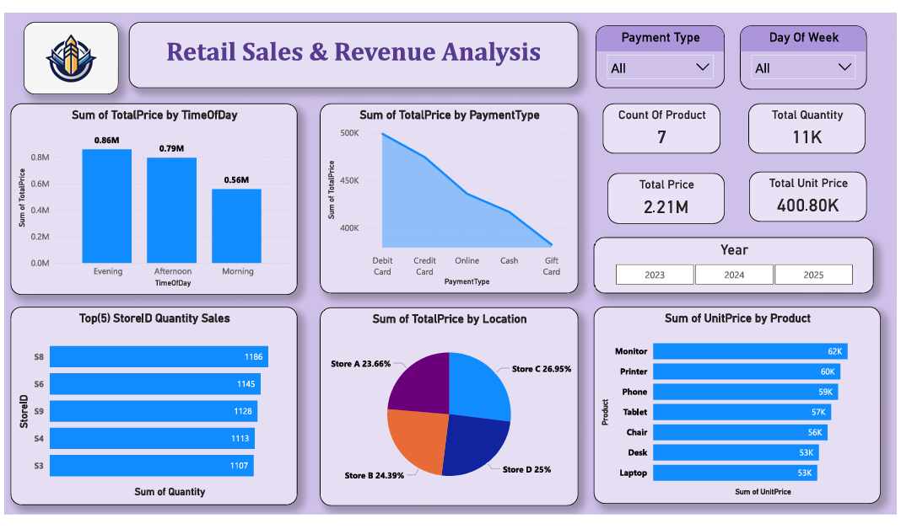

# 📊 Retail Sales Intelligence Dashboard

An interactive Power BI dashboard designed to analyze retail sales performance, revenue trends, store efficiency, product demand, and customer purchasing behavior. This project transforms raw retail transaction data into meaningful business insights through data visualization and KPI tracking.

---

## 🚀 Project Overview

The Retail Sales Intelligence Dashboard helps businesses monitor and evaluate their sales performance across multiple stores, products, locations, and payment methods.

Using Power BI, the dashboard provides a clear overview of key business metrics and enables data-driven decision-making through interactive filters and visual reports.

---

## 🎯 Objectives

- Analyze overall sales and revenue performance.
- Identify top-performing stores and products.
- Understand customer purchasing patterns.
- Compare sales across locations.
- Evaluate payment method preferences.
- Monitor sales trends based on time of day.

---

## 🛠️ Tools & Technologies

- **Power BI**
- **Microsoft Excel**
- **DAX (Data Analysis Expressions)**
- **Data Visualization**
- **Business Intelligence**
- **Data Analytics**

---

## 📂 Dataset Information

The dataset contains retail transaction records including:

- Transaction Date & Time
- Store Information
- Product Details
- Quantity Sold
- Unit Price
- Total Revenue
- Payment Method
- Location
- Day of Week
- Time of Day

---

## 📈 Key Performance Indicators (KPIs)

- Total Revenue
- Total Quantity Sold
- Total Unit Price
- Store-wise Sales Performance
- Product-wise Revenue Analysis
- Location-wise Revenue Distribution
- Payment Method Analysis
- Time-of-Day Sales Analysis

---

## 📊 Dashboard Features

### 💰 Revenue Analysis
Track total revenue generated across stores and locations.

### 🏪 Store Performance
Identify top-performing stores based on sales volume and revenue.

### 📦 Product Analysis
Analyze product demand and revenue contribution.

### 🌍 Location Insights
Compare sales performance across different locations.

### 💳 Payment Method Analysis
Understand customer payment preferences.

### ⏰ Time-Based Analysis
Evaluate sales performance during Morning, Afternoon, and Evening periods.

### 🎛️ Interactive Filters
- Year Filter
- Day of Week Filter
- Payment Type Filter

---

## 🔍 Business Insights

- Identified top-performing stores based on sales volume.
- Analyzed revenue contribution by location.
- Determined the most profitable product categories.
- Evaluated customer payment behavior.
- Compared sales performance across different time periods.
- Enabled faster business reporting through interactive dashboards.

---

## 📸 Dashboard Preview

### Main Dashboard



---

## 📁 Project Structure

```text
Retail-Sales-Intelligence-Dashboard/
│
├── Retail_Sales_Dashboard.pdf
├── Retail-Store-Transactions.xlsx
├── dashboard.png
├── README.md
```

---

## 💡 Skills Demonstrated

- Data Cleaning
- Data Transformation
- Data Modeling
- KPI Development
- DAX Calculations
- Business Intelligence Reporting
- Data Visualization
- Dashboard Design
- Analytical Thinking

---

## 🎓 Learning Outcome

Through this project, I gained hands-on experience in creating interactive business dashboards, transforming raw retail data into actionable insights, and presenting key metrics using modern Business Intelligence tools.

---

## 👨‍💻 Author

**Prasad Joshi**

Aspiring Data Scientist | AI & ML Enthusiast | Data Analytics Learner

### Connect With Me

- LinkedIn: *(https://www.linkedin.com/in/prasad-joshi-8496b12a6/)*

---

⭐ If you found this project useful, consider giving it a star.
